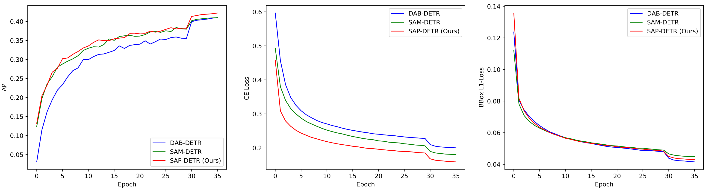
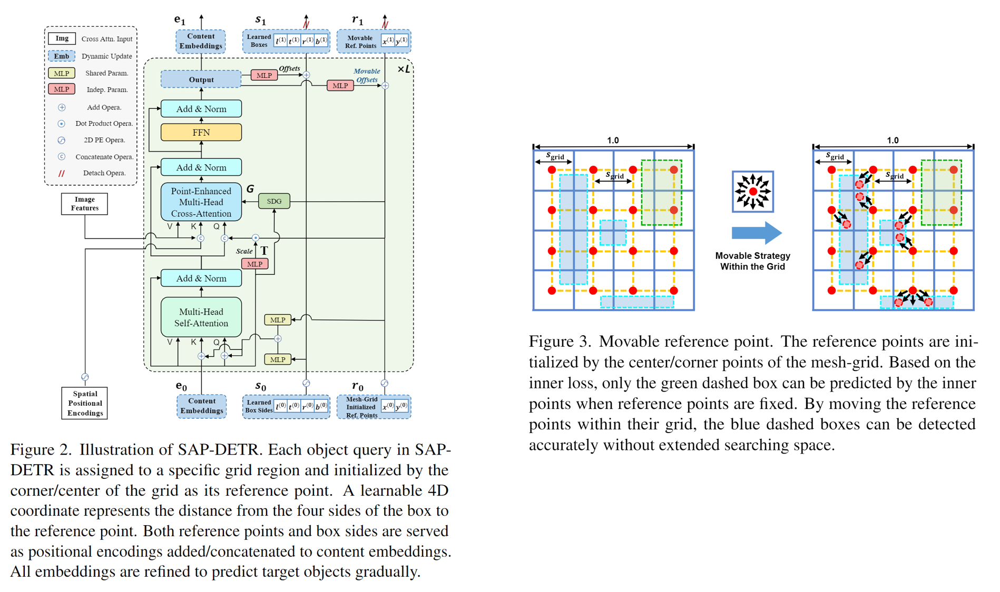

# SAP-DETR

This is the official pytorch implementation of our CVPR 2023 paper [SAP-DETR](https://arxiv.org/abs/2211.02006). 

Authors: [Yang Liu](https://scholar.google.com/citations?user=ock4qjYAAAAJ&hl=zh-CN), [Yao Zhang](https://scholar.google.com/citations?user=vxfJSJIAAAAJ&hl=zh-CN), [Yixin Wang](https://scholar.google.com/citations?user=ykYrXtAAAAAJ&hl=zh-CN), [Yang Zhang](https://scholar.google.com/citations?user=fwg2QysAAAAJ&hl=zh-CN), [Jiang Tian](https://scholar.google.com/citations?user=CC_HnVQAAAAJ&hl=zh-CN),   [Zhongchao Shi](https://scholar.google.com/citations?user=GASgQxEAAAAJ&hl=zh-CN), [Jianping Fan](https://scholar.google.com/citations?user=-YsOqQcAAAAJ&hl=zh-CN), [Zhiqiang He](https://ieeexplore.ieee.org/author/37085386255)

## Update
[2023/3/17] Other variant models will go public soon.

[2023/2/28] Our work has been accepted by CVPR 2023.

## Introduction

**Abstract**: Recently, the dominant DETR-based approaches apply central-concept spatial prior to accelerate Transformer detector convergency. These methods gradually refine the reference points to the center of target objects and imbue object queries with the updated central reference information for spatially conditional attention. However, centralizing reference points may severely deteriorate queries' saliency and confuse detectors due to the indiscriminative spatial prior. To bridge the gap between the reference points of salient queries and Transformer detectors, we propose SAlient Point-based DETR (SAP-DETR) by treating object detection as a transformation from salient points to instance objects. In SAP-DETR, we explicitly initialize a query-specific reference point for each object query, gradually aggregate them into an instance object, and then predict the distance from each side of the bounding box to these points. By rapidly attending to query-specific reference region and other conditional extreme regions from the image features, SAP-DETR can effectively bridge the gap between the salient point and the query-based Transformer detector with a significant convergency speed. Our extensive experiments have demonstrated that SAP-DETR achieves 1.4 times convergency speed with competitive performance. Under the standard training scheme, SAP-DETR stably promotes the SOTA approaches by 1.0 AP. Based on ResNet-DC-101, SAP-DETR achieves 46.9 AP.




## Main Results
We provide our models with R50 and R101 backbone for **SAP-DETR**. 

The pre-trained model of **SAP-DINO-DETR** and **SAP-Group-DETR** is expected to go public soon.

<table>
  <thead>
    <tr style="text-align: right;">
      <th>Method</th>
      <th>Epochs</th>
      <th>Params (M)</th>
      <th>FLOPs (G)</th>
      <th>AP</th>
      <th>AP<sub>S</sub></th>
      <th>AP<sub>M</sub></th>
      <th>AP<sub>L</sub></th>
      <th>URL</th>
    </tr>
  </thead>
  <tbody>
    <tr>
      <td align="center">SAP-DETR-R50</td>
      <td align="center">50</td>
      <td align="center">47</td>
      <td align="center">92</td>
      <td align="center">43.1</td>
      <td align="center">22.9</td>
      <td align="center">47.1</td>
      <td align="center">62.1</td>
      <td><a href="https://pan.baidu.com/s/1XKbWD4BGj4zyRmX2wIy_PA?pwd=i931">Baidu Netdisk</a><br><a href="https://drive.google.com/drive/folders/15_R2JWKM4qCUw15iV05FIMpTa5XHXeKB?usp=sharing">&thinsp;Google Drive</a></td>
    </tr>
      <td align="center">SAP-DETR-DC5-R50</td>
      <td align="center">50</td>
      <td align="center">47</td>
      <td align="center">197</td>
      <td align="center">46.0</td>
      <td align="center">26.4</td>
      <td align="center">50.2</td>
      <td align="center">62.6</td>
      <td><a href="https://pan.baidu.com/s/1t_UjYRJZ-YlHZ0eHXcAfjQ?pwd=893g">Baidu Netdisk</a><br><a href="https://drive.google.com/drive/folders/1m1YbCNchy_o8TZfcMgAhbesbQ70iypXy?usp=sharing">&thinsp;Google Drive</a></td>
    </tr>
    <tr>
      <td align="center">SAP-DETR-R101</td>
      <td align="center">50</td>
      <td align="center">67</td>
      <td align="center">158</td>
      <td align="center">44.4</td>
      <td align="center">24.1</td>
      <td align="center">48.7</td>
      <td align="center">63.1</td>
      <td><a href="https://pan.baidu.com/s/11UaarBTW2zQZt1JhyE9hxA?pwd=08kf">Baidu Netdisk</a><br><a href="https://drive.google.com/drive/folders/1CEwhh1BQFUyFUcoLldrMc4ES68vTpvbv?usp=sharing">&thinsp;Google Drive</a></td>
    </tr>
    <tr>
      <td align="center">SAP-DETR-DC5-R101</td>
      <td align="center">50</td>
      <td align="center">67</td>
      <td align="center">266</td>
      <td align="center">46.9</td>
      <td align="center">27.9</td>
      <td align="center">51.3</td>
      <td align="center">64.3</td>
      <td><a href="https://pan.baidu.com/s/1VDPEDy11BUfGffxtjbISkQ?pwd=eskx">Baidu Netdisk</a><br><a href="https://drive.google.com/drive/folders/1JLDSIvdkByqD129GW4p304SY7ZzU1Uu7?usp=share_link">&thinsp;Google Drive</a></td>
    </tr>
  </tbody>
</table>

Notes: 
- "DC5" means removing the stride in C5 stage of ResNet and add a dilation of 2 instead. 
- The results are sensitive to the batch size. We use 16 (4 images each GPU x 4 A100 GPUs) for ResNet-C5 and 8 (1 image each GPU x 8 A100 GPUs) for ResNet-C5. 
- The Params and FLOPs are measured by Detectron2 on NVIDIA A100 GPU.


## Installation
We use the great DETR project as our codebase, hence no extra dependency is needed for our **SAP-DETR**.

We test our models under ```python=3.8,pytorch=1.9.0,cuda=11.4```. Other versions might be available as well.

1. Clone this repo
```sh
git clone https://https://github.com/liuyang-ict/SAP-DETR.git
cd SAP-DETR
```

2. Install Pytorch and torchvision

Follow the instrction on https://pytorch.org/get-started/locally/.
```sh
# an example:
conda install -c pytorch pytorch torchvision
```

3. Install pycocotools

Follow the instrction on https://github.com/cocodataset/cocoapi.
```sh
# an example:
conda install -c conda-forge pycocotools
```

4. Install Detectron2

Follow the instrction on https://detectron2.readthedocs.io/en/latest/tutorials/install.html.
```sh
# an example:
python -m pip install 'git+https://github.com/facebookresearch/detectron2.git'
```

5. Install other needed packages
```sh
pip install -r requirements.txt
```

## Data
Please download [COCO 2017](https://cocodataset.org/) dataset and organize them as following:
```
COCODIR/
  └── images/
    ├── train2017/
    ├── val2017/
  └── annotations/
  	├── instances_train2017.json
  	└── instances_val2017.json
```


## Run
We use the standard **SAP-DETR-R50** and **SAP-DETR-DC5-R50** as examples for training and evalulation.

Replace the args '--coco_path' to your coco path before running.

### Eval our pretrianed models

Download our SAP-DETR-R50 model checkpoint and perform the command below. 

```sh
# for sap_detr_r50: 43.1 AP
sh ./scripts/test/r50-50epoch.sh

# for sap_detr_dc5_r50: 46.0 AP
sh ./scripts/test/r50-dc-50epoch.sh
```


### Training your own models
You can also train our model on a single process: 
```sh
# for sap_detr
python main.py -m sap_detr \
  --output_dir outputs/R50 \
  --batch_size 1 \
  --epochs 50 \
  --lr_drop 40 \
  --num_select 300 \
  --num_queries 306 \
  --warmup_iters 1000 \
  --meshgrid_refpoints_xy \
  --bbox_embed_diff_each_layer \
  --newconvinit \
  --sdg \
  --coco_path /path/to/your/COCODIR  # replace the args to your COCO path
```

### Distributed Run
As the training is time consuming, we suggest to train the model on multi-device.

**Training with multi-processes on a single node:**
```sh
# for sap_detr: 43.1 AP
sh ./scripts/train/r50-50epoch.sh

# for sap_detr_dc5_r50: 46.0 AP
sh ./scripts/train/r50-dc-50epoch.sh
```

**Training with multi-processes on multiple nodes:**

For example, the command for training SAP-DETR on 2 nodes of each with 4 GPUs is as following:

On node 0:
```sh
MASTER_ADDR=<IP address of node 0> NODE_RANK=0 GPUS_PER_NODE=4 ./tools/run_dist_launch.sh 8 ./scripts/train-mn/r50-50epoch.sh
```

On node 1:
```sh
MASTER_ADDR=<IP address of node 0> NODE_RANK=1 GPUS_PER_NODE=4 ./tools/run_dist_launch.sh 8 ./scripts/train-mn/r50-50epoch.sh
```


## Citation
```bibtex
@inproceedings{liu2023sap,
  title={Sap-detr: Bridging the gap between salient points and queries-based transformer detector for fast model convergency},
  author={Liu, Yang and Zhang, Yao and Wang, Yixin and Zhang, Yang and Tian, Jiang and Shi, Zhongchao and Fan, Jianping and He, Zhiqiang},
  booktitle={Proceedings of the IEEE/CVF Conference on Computer Vision and Pattern Recognition},
  pages={15539--15547},
  year={2023}
}
```
